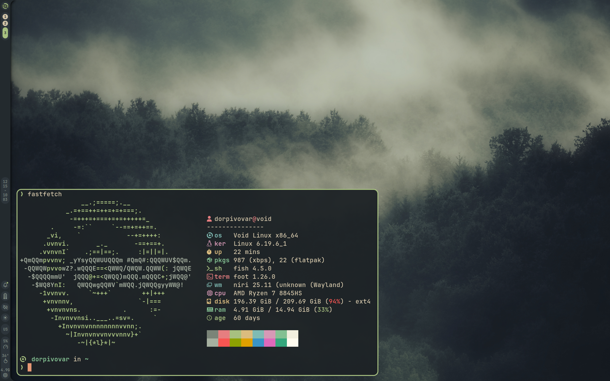
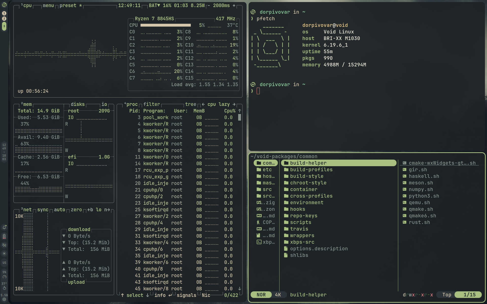
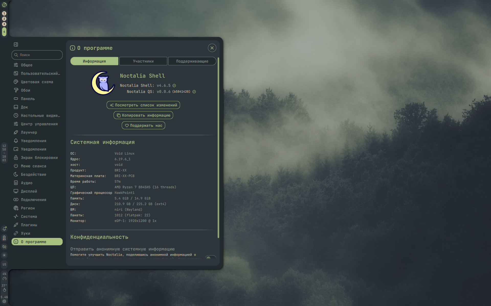

# ✨ dotfiles

**Void Linux + niri + Noctalia Shell** setup.

<p align="center">
  
</p>

## 📸 Screenshots

<p align="center">
  
  
</p>

## 📊 Program Mapping

| Category | Used |
| --- | --- |
| Distro | [Void Linux](https://voidlinux.org/) |
| Wayland Compositor | [niri](https://github.com/niri-wm/niri) |
| Shell | [fish](https://fishshell.com/) + [starship](https://starship.rs/)|
| System Shell / Panel | [Noctalia Shell](https://noctalia.dev/) |
| Terminal Emulator| [foot](https://codeberg.org/dnkl/foot) |

## 🚀 Installation

### 1) Install packages (Void Linux)

```bash
sudo xbps-install -S git stow
```

### 2) Clone

```bash
git clone https://github.com/dorpivovar/void-dotfiles.git ~/.dotfiles
cd ~/.dotfiles
```

### 3) Deploy

```bash
stow .
```
